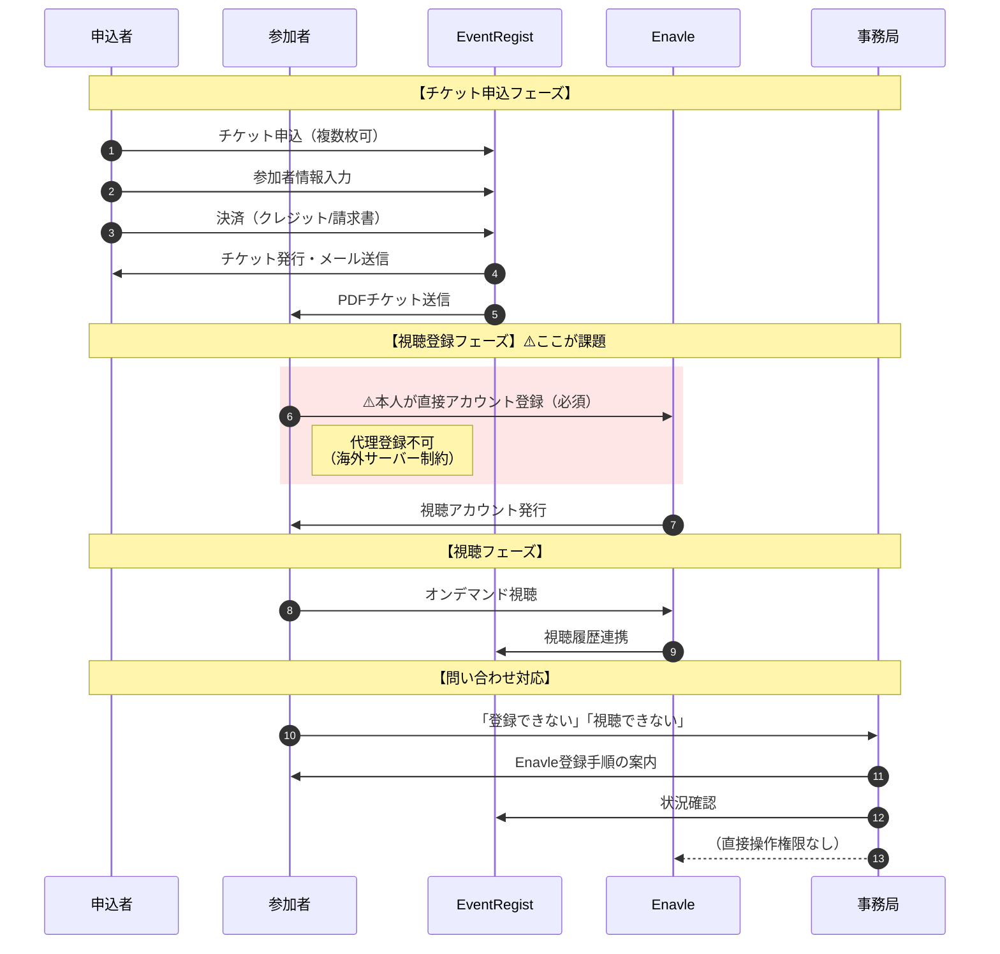
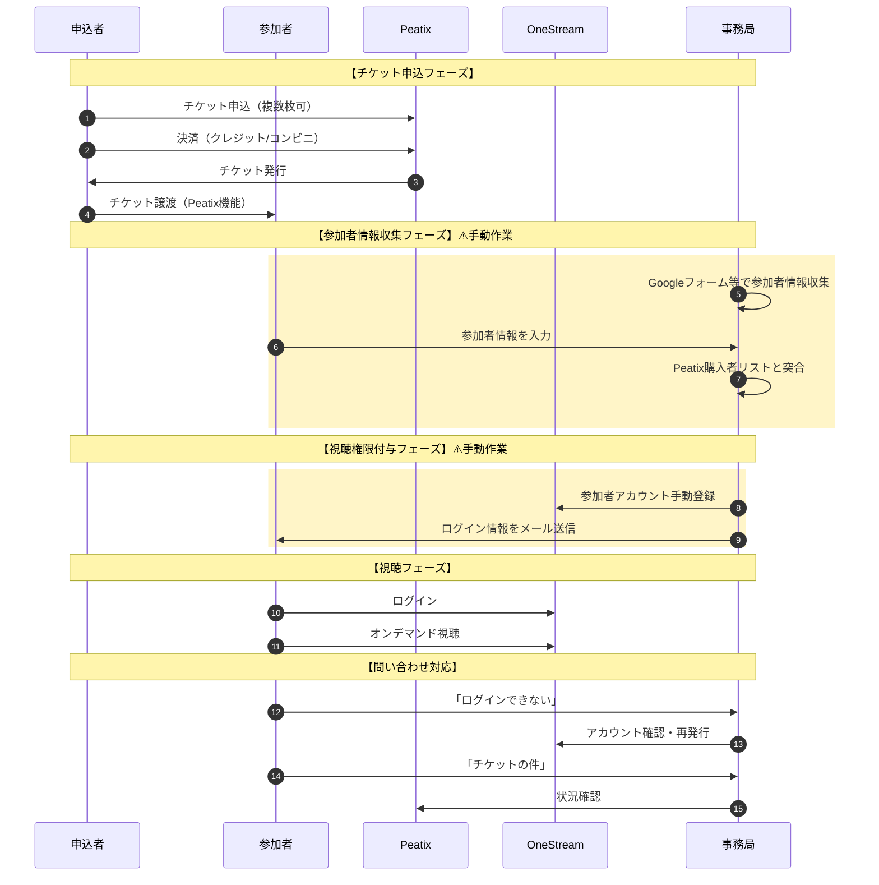
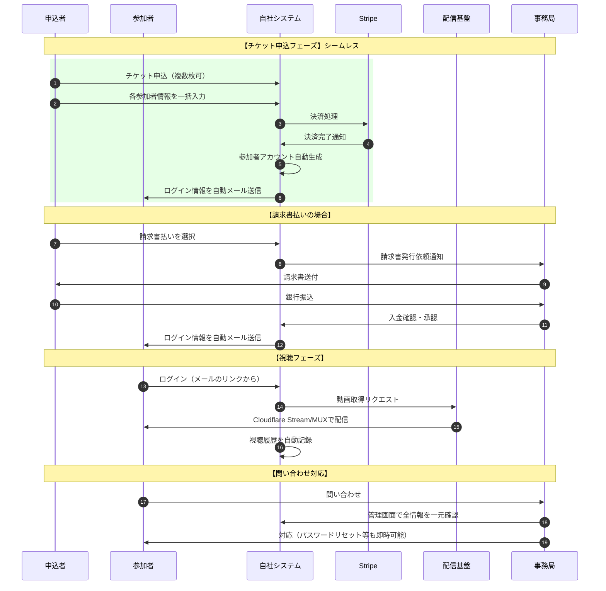
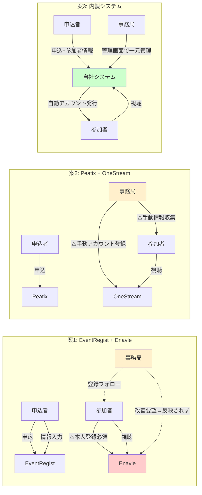

# JTF翻訳祭 ハイブリッド開催システム比較検討資料

チケット申込システムとオンデマンド配信システムの連携について、3案を多角的に比較検討する。

---

## ロール別フロー図（Mermaid）

以下の4つのロールで各案の運用フローを視覚化する：
- **申込者**: チケットを申し込む人（参加者を兼ねる場合あり、総務部等の代理申込も含む）
- **参加者**: 実際にイベントに参加・視聴する人
- **事務局**: 登録作業・事務作業・問い合わせ対応を行うJTFスタッフ
- **サービス**: SaaS・サーバー等のシステム

---

### 案1: EventRegist + Enavle フロー図



**案1の課題ポイント**:
- チケット申込と視聴登録が分離（参加者が2回登録作業）
- Enavle登録でつまずく参加者への問い合わせ対応負荷
- プレーヤーの品質問題に対して事務局が改善を依頼しても反映されにくい

---

### 案2: Peatix + OneStream フロー図



**案2の課題ポイント**:
- 事務局の手動作業が多い（情報収集、突合、アカウント登録）
- 2つのサービス間でデータ連携がない
- 問い合わせ窓口が分散（Peatix関連/OneStream関連）

---

### 案3: CMS + 内製 フロー図



**案3のメリットポイント**:
- 申込者が入力した参加者情報から自動でアカウント生成
- 代理申込→即視聴可能なシームレスな体験
- 全データを自社管理画面で一元確認
- 問い合わせ対応も一箇所で完結

---

### ロール別作業負荷の比較



---

### ロール別負荷サマリー表

| ロール | 案1: EventRegist+Enavle | 案2: Peatix+OneStream | 案3: 内製 |
|---|---|---|---|
| **申込者** | ○ 申込は簡単 | ○ 申込は簡単 | ◎ 参加者情報も一括入力 |
| **参加者** | △ Enavle登録が必要 | △ 別途情報入力が必要 | ◎ メールのリンクから即視聴 |
| **事務局** | △ 登録フォロー・クレーム対応 | ✕ 手動作業が多い | ○ 管理画面で一元対応 |
| **サービス連携** | △ 2システム分離（本人登録必須） | ✕ 完全分離（手動連携） | ◎ 統合（自動連携） |

---

## 比較対象3案の概要

| 案 | チケット申込 | オンデマンド配信 | 連携方式 |
|---|---|---|---|
| **案1** | EventRegist | Enavle | 統合（同一ベンダー）※制約あり |
| **案2** | Peatix等 | OneStream | 分離（別サービス） |
| **案3** | microCMS/WordPress | Cloudflare Stream/MUX | 内製化 |

> ⚠️ **案1の重要な制約**: Enavleは海外サーバー（シンガポール）で運用されているため、オンデマンド視聴には**各参加者本人がEnavleに直接登録する必要がある**。代理申込（視聴登録）は原則不可。

---

## 案1: EventRegist + Enavle（統合型）

### サービス概要
- **EventRegist**: 国内大手イベント管理プラットフォーム（5万団体以上が利用）
- **Enavle**: シンガポール Actioport社開発のバーチャルイベントプラットフォーム（EventRegistが日本販売代理）

### 料金体系
| 項目 | 金額 |
|---|---|
| EventRegist基本機能 | 無料 |
| 有料チケット決済手数料 | 販売額の8% |
| Premium機能（enavle連携含む） | 550,000円〜/イベント |
| 連携サービス利用費 | 申込人数により変動 |

### メリット

#### 運用面
- **ワンストップ管理**: チケット販売〜視聴管理まで一元化
- **視聴履歴の自動連携**: 申込者と視聴データが自動で紐付け
- **営業・分析の効率化**: どの参加者がどこまで視聴したかを一括把握
- **問い合わせ窓口の一本化**: トラブル時の対応がスムーズ

#### 機能面
- YouTube/Facebook/Zoom等の動画配信サービスと連携可能
- セッション毎のアンケート機能（視聴画面内ポップアップ）
- スポンサー広告動画配信機能
- ブレイクアウトセッション対応
- チャット機能・ビジネスマッチング機能

#### 実績・信頼性
- 国内法人イベントでの豊富な実績
- 日本語サポート体制あり
- Salesforce/HubSpot/Marketo等のMAツール連携

### デメリット

#### コスト面
- **高額な初期費用**: Premium機能利用に55万円〜/イベント
- **人数連動コスト**: 大規模イベントでは費用が増大
- **毎年のイベント開催で継続的な固定費発生**

#### 柔軟性
- Enavle独自のUIに依存（カスタマイズ制限）
- ベンダーロックイン（他サービスへの移行が困難）
- 料金体系が不透明（要問い合わせ）

#### その他
- 海外製プラットフォーム（Enavle）への依存
- サービス終了・仕様変更リスク

#### ⚠️ 重要な制約：Enavleの海外サーバー問題
- **Enavleはシンガポールの海外サーバーで運用**
- **代理申込が原則不可**: 視聴者本人がEnavleに直接アカウント登録する必要がある
- 総務部が社員分を一括申込しても、**各視聴者が個別にEnavle登録が必要**
- 招待チケットの場合も、被招待者自身がEnavleにサインアップする手間が発生
- **法人の代理購入ユースケースとの相性が悪い**

---

### 📋 事務局コメント（数年間の運用実績に基づく評価）

> **JTF翻訳祭では過去数年間、案1（EventRegist + Enavle）を採用して運用してきた実績がある。**
> 以下は、その運用経験から得られた課題・所感である。

#### Enavleプレーヤーに関する問題点
- **視聴プレーヤーの評判が悪い**: 参加者からの不満・クレームが発生
- **UIや操作性に課題あり**: 直感的でない、使いにくいとの声
- **再生品質・安定性への懸念**: 視聴体験の質が期待を下回るケースがある

#### ベンダー対応に関する問題点
- **フィードバックに対する改善が遅い/されない**:
  - 事務局から複数回にわたり改善要望を伝達
  - しかし、目立った改善が見られない状況が継続
- **海外ベンダー特有のコミュニケーション課題**:
  - 日本市場特有のニーズへの対応が不十分
  - 改善サイクルが遅く、イベント運営のスケジュールに合わない

#### 総合所感
- 高額なシステム利用料（55万円〜/イベント）に見合う価値が得られているか疑問
- 参加者体験の向上を目指す観点から、**システムの見直しを検討する時期に来ている**
- 現行システムの継続利用は、参加者満足度・JTFブランドイメージへの悪影響が懸念される

---

## 案2: チケット申込サイト + OneStream（分離型）

### サービス概要
- **チケット申込サイト**: Peatix、Doorkeeper等の既存サービス
- **OneStream**: 株式会社ルートチーム運営の動画配信サイト構築プラットフォーム

### 料金体系

#### Peatixの場合
| 項目 | 金額 |
|---|---|
| 初期費用・月額費用 | 無料 |
| 有料チケット決済手数料 | 4.9% + 99円/枚 |
| 振込手数料 | 210円/イベント |

#### OneStream
| プラン | 月額料金 | 主な仕様 |
|---|---|---|
| 初期費用 | 0円 | - |
| スタータープラン | 9,800円〜 | 基本機能 |
| ビジネスプラン | 要問合せ | 独自ドメイン対応 |
| エンタープライズ | 要問合せ | 動画容量300GB〜、転送量無制限 |

### メリット

#### コスト面
- **低い初期投資**: Peatixは基本無料、OneStreamは月額9,800円〜
- **従量課金が少ない**: Peatixの手数料は約5%で業界最低水準
- **年間コストの予測可能性**: 月額固定のOneStreamで計算しやすい

#### 運用面
- **導入ハードルが低い**: 両サービスとも専門知識不要
- **サービスの独立性**: 片方に問題があっても他方は継続可能
- **柔軟なサービス選択**: チケット側はPeatix以外も選択可能

#### 機能面
- OneStreamはグループ別配信対応
- 会員課金機能（月額/年額対応）
- 学会・セミナー利用実績あり

### デメリット

#### 連携面
- **手動での参加者管理が必要**: チケット購入者リストとOneStream会員の紐付け作業
- **二重管理の手間**: 申込者情報を両システムで管理
- **視聴権限付与の運用負荷**: チケット購入者へのアクセス権限を手動設定

#### ユーザー体験
- **別々のアカウント管理**: 参加者が2つのサービスに登録する必要あり
- **導線の分断**: チケット購入→視聴ページへの誘導が複雑化

#### その他
- データ統合分析が困難
- 問い合わせ窓口が分散

---

## 案3: CMS + ストリーミングサービス（内製化）

### サービス概要
- **CMS**: microCMS（国産ヘッドレスCMS）またはWordPress
- **動画配信**: Cloudflare Stream または MUX

### 料金体系

#### microCMS
| プラン | 月額料金 | API数 |
|---|---|---|
| Hobby | 無料 | 3 |
| Team | 4,900円 | 10 |
| Business | 31,900円 | 無制限 |
| Enterprise | 要問合せ | 要相談 |

※会員機能は外部認証（Auth0、Firebase等）との組み合わせが必要

#### WordPress
| 項目 | 費用目安 |
|---|---|
| サーバー費用 | 1,000〜5,000円/月 |
| ドメイン | 1,000〜3,000円/年 |
| WooCommerce | 無料 |
| チケット販売プラグイン | 無料〜30,000円/年 |

#### Cloudflare Stream
| 項目 | 料金（USD） |
|---|---|
| 動画保存 | $5/1,000分/月 |
| 動画配信 | $1/1,000分視聴 |
| Pro/Businessプラン特典 | 100分保存+10,000分配信/月無料 |

#### MUX
| 項目 | 料金（USD） |
|---|---|
| 動画エンコード | $0.015/分 |
| ストレージ | $0.00192/分/月 |
| 配信 | $0.004/分視聴 |

### メリット

#### カスタマイズ性
- **完全なUI/UX制御**: JTFブランドに合わせた独自デザイン
- **機能の自由設計**: 必要な機能だけを実装
- **他システムとの柔軟な連携**: API経由で任意のサービスと接続

#### コスト面
- **従量課金で初期投資を抑制**: 視聴量に応じた最適化
- **スケールメリット**: 大規模になるほど相対的に安価
- **ベンダーフリー**: サービス変更が容易

#### データ管理
- **自社でのデータ所有**: 参加者データを完全管理
- **分析の自由度**: 任意の指標でデータ分析可能
- **プライバシー対応**: 個人情報管理ポリシーを自社基準で設定

#### 長期的視点
- **資産化**: 構築したシステムは翌年以降も再利用可能
- **ノウハウ蓄積**: 内部に技術知見が蓄積
- **拡張性**: 将来的な機能追加が容易

### デメリット

#### 技術的ハードル
- **開発リソースが必要**: エンジニアまたは外部委託が必須
- **構築期間**: 数週間〜数ヶ月の開発期間
- **技術的知識**: API連携・認証システムの理解が必要

#### 運用負荷
- **保守・メンテナンス責任**: 障害対応は自己責任
- **セキュリティ管理**: 脆弱性対応を自社で実施
- **アップデート対応**: 各サービスの仕様変更に追従

#### リスク
- **初期開発の失敗リスク**: 要件定義不足による手戻り
- **担当者依存**: 担当者離脱時の引継ぎ問題
- **サポート不在**: トラブル時は自己解決が基本

---

## 比較一覧表

| 評価項目 | 案1: EventRegist+Enavle | 案2: Peatix+OneStream | 案3: CMS+内製 |
|---|:---:|:---:|:---:|
| **初期コスト** | ✕ 高（55万円〜） | ◎ 低（ほぼ無料） | △ 中（開発費依存） |
| **ランニングコスト** | △ 中〜高 | ○ 低〜中 | ◎ 低（従量制） |
| **導入の容易さ** | ○ 容易 | ◎ 非常に容易 | ✕ 開発必要 |
| **システム連携** | △ Enavle登録が別途必要 | ✕ 手動連携 | ○ 自由設計 |
| **カスタマイズ性** | △ 制限あり | △ 制限あり | ◎ 完全自由 |
| **運用負荷** | △ 登録フォロー要 | △ 中 | △ 中〜高 |
| **ユーザー体験** | △ Enavle登録の手間 | △ 分断 | ○ 設計次第 |
| **代理申込（視聴）** | **✕ 不可（海外サーバー）** | ✕ 手動対応 | ◎ 自由設計 |
| **データ管理** | △ ベンダー依存 | △ 分散管理 | ◎ 自社管理 |
| **技術リスク** | ○ 低 | ○ 低 | △ 中 |
| **長期的拡張性** | △ ベンダー依存 | ○ 選択可能 | ◎ 高い |
| **サポート体制** | ◎ 手厚い | ○ あり | ✕ 自己対応 |

---

## 複数枚チケット購入・代理申込対応

JTF翻訳祭では、以下のようなユースケースが想定される：
- **総務部・営業部による一括購入**: 社内複数名分のチケットをまとめて購入
- **クライアント企業の招待**: 取引先への招待チケット発行
- **グループ参加**: チーム単位での申込

### 各案の対応状況

#### 案1: EventRegist + Enavle

| 機能 | 対応状況 | 詳細 |
|---|:---:|---|
| 複数枚一括購入 | ◎ | 1回の申込で複数枚購入可能 |
| 購入上限設定 | ◎ | Basic+以上で1アカウントあたりの上限枚数設定可 |
| 代理申込（チケット購入） | ◎ | 申込者が同行者分のPDFチケットを送信可能 |
| 代理申込（視聴登録） | **✕** | ⚠️ **Enavleは海外サーバーのため視聴者本人の登録が必須** |
| 参加者情報収集 | ◎ | 独自アンケートで各参加者の情報を収集可能 |
| 招待チケット発行 | ◎ | プロモーションコード機能で無料/割引チケット発行 |
| 請求書払い | ◎ | Premium機能で対応（銀行振込も可） |
| 参加者別チェックイン | ◎ | QRコード付き宛名ラベル一括印刷対応 |

> ⚠️ **重要な制約**: Enavleはシンガポールの海外サーバーで運用されているため、**オンデマンド視聴には各参加者本人がEnavleに直接アカウント登録する必要がある**。総務部が代理で視聴アカウントを作成することは原則不可。

**運用イメージ（制約を考慮）**:
1. 総務部担当者がEventRegistで10名分を一括申込
2. 申込時に各参加者の氏名・メールを入力（独自フォーム）
3. 請求書発行→銀行振込で決済
4. 各参加者にPDFチケット（視聴用リンク含む）が自動配信
5. **⚠️ 各参加者が個別にEnavleにサインアップする必要あり**
6. 視聴履歴は参加者単位で管理画面から確認可能

**この制約による影響**:
- 参加者へのEnavle登録案内・フォローが必要
- ITリテラシーの低い参加者は登録で躓く可能性
- 招待された側にも登録の手間を強いることになる
- 「チケットを購入したのに視聴できない」問い合わせリスク

#### 案2: Peatix + OneStream

| 機能 | 対応状況 | 詳細 |
|---|:---:|---|
| 複数枚一括購入 | ○ | 1回の申込で複数枚購入可能 |
| 購入上限設定 | ○ | 主催者側で設定可能 |
| 代理申込 | △ | チケット譲渡機能で対応（登録代理は不可） |
| 参加者情報収集 | △ | 申込者のみ。同行者情報は別途収集が必要 |
| 招待チケット発行 | ○ | 割引コード機能あり |
| 請求書払い | ✕ | 非対応（クレジット/コンビニ決済のみ） |
| 参加者別チェックイン | △ | 同時チェックインのみ（個別不可） |

**課題と対策**:
- **参加者情報収集**: Googleフォーム等で別途収集が必要
- **請求書払い非対応**: 法人は別ルート（直接銀行振込→手動チケット発行）で対応
- **OneStreamへの権限付与**: チケット購入者リストを元に手動でアカウント作成・権限設定

**運用イメージ**:
1. 総務部担当者がPeatixで10名分を一括購入（クレジット決済）
2. 別途Googleフォームで各参加者の情報を収集
3. 担当者が購入後、各同行者にチケットを譲渡（Peatix機能）
4. 運営側がOneStreamに参加者アカウントを手動登録
5. 各参加者にOneStreamログイン情報をメール送信

#### 案3: CMS + 内製（WordPress + WooCommerce例）

| 機能 | 対応状況 | 詳細 |
|---|:---:|---|
| 複数枚一括購入 | ◎ | 設計次第で自由に実装可能 |
| 購入上限設定 | ◎ | 自由に設定可能 |
| 代理申込 | ◎ | 各参加者情報入力フォームを設計可能 |
| 参加者情報収集 | ◎ | チケット枚数分の入力フォームを動的生成 |
| 招待チケット発行 | ◎ | クーポン機能またはカスタム実装 |
| 請求書払い | ◎ | WooCommerce拡張で対応可能 |
| 参加者別チェックイン | ◎ | 設計次第で自由に実装可能 |

**推奨プラグイン構成**:
- **FooEvents for WooCommerce** ($49〜): 参加者別チケット発行、QRコード生成
- **Tickera**: WooCommerce連携、20以上の決済ゲートウェイ対応
- **Event Tickets Plus**: 各参加者の詳細情報収集、自動メール確認

**運用イメージ**:
1. 総務部担当者が申込フォームで10名分を選択
2. 各参加者の氏名・メール・会社名を入力（動的フォーム）
3. Stripe決済 または 請求書払いを選択
4. 各参加者に個別のログイン情報・視聴URLが自動配信
5. 視聴履歴はデータベースで一元管理

### 複数枚購入対応の比較表

| 評価項目 | 案1: EventRegist | 案2: Peatix | 案3: 内製 |
|---|:---:|:---:|:---:|
| **一括購入の容易さ** | ◎ | ○ | ◎ |
| **各参加者情報収集** | ◎ | △（別途対応要） | ◎ |
| **請求書払い対応** | ◎ | ✕ | ◎ |
| **招待チケット発行** | ◎ | ○ | ◎ |
| **代理での視聴登録** | **✕（Enavle制約）** | ✕（手動） | ◎ |
| **視聴権限の自動付与** | △（本人登録後） | ✕（手動） | ◎ |
| **参加者別の視聴管理** | ◎ | △ | ◎ |
| **運用負荷** | △（登録フォロー要） | △ 高い | ○ 設計次第 |

> ⚠️ **案1の注意点**: EventRegistでのチケット購入は代理可能だが、Enavle（オンデマンド配信）の視聴登録は各参加者本人が行う必要がある。チケット購入と視聴登録が分離しているため、法人の代理購入ユースケースでは運用負荷が高くなる。

---

## 決済システム比較

### 各サービスの決済手数料

| サービス | 決済手数料 | 対応決済方法 | 備考 |
|---|---|---|---|
| **EventRegist** | 8% | クレジット、請求書、銀行振込 | 請求書払いはPremium機能 |
| **Peatix** | 4.9% + 99円/枚 | クレジット、コンビニ、PayPal | 請求書払い非対応 |
| **Stripe** | 3.6% | クレジット、Apple Pay、Google Pay | 国際ブランド対応 |
| **PayPal** | 3.6% + 40円 | PayPal残高、クレジット | 海外決済に強い |

### Stripe導入のメリット・デメリット

#### メリット
- **低い手数料**: 3.6%（EventRegistの8%より大幅に安い）
- **豊富な決済手段**: Apple Pay、Google Pay、Klarna等23種類以上
- **開発者フレンドリー**: 充実したAPI・ドキュメント
- **グローバル対応**: 120カ国以上で利用可能
- **セキュリティ**: PCI DSS Level 1準拠
- **サブスクリプション対応**: 定期課金も簡単に実装

#### デメリット
- **技術的な実装が必要**: 案3（内製）でのみ直接利用可能
- **日本語サポートの制限**: 英語中心のドキュメント
- **返金時の手数料**: 返金しても決済手数料は戻らない

### 案別の決済システム推奨構成

#### 案1: EventRegist + Enavle
```
決済: EventRegist内蔵決済（8%）
├── クレジットカード決済
├── 請求書払い（Premium）
└── 銀行振込（Premium）
```
- Stripe導入: **不可**（EventRegistの決済システムを使用）

#### 案2: Peatix + OneStream
```
チケット決済: Peatix決済（4.9% + 99円/枚）
├── クレジットカード
├── コンビニ決済
└── PayPal

配信サービス: OneStream
└── 別途課金が必要な場合はOneStream内で設定
```
- Stripe導入: **不可**（Peatixの決済システムを使用）
- 請求書払い: **非対応**（別途対応が必要）

#### 案3: CMS + 内製
```
決済: Stripe（3.6%）+ 請求書払いオプション
├── Stripeダッシュボード
│   ├── クレジットカード
│   ├── Apple Pay / Google Pay
│   └── コンビニ決済（別途設定）
│
└── 請求書払い（自社対応）
    ├── WooCommerce請求書プラグイン
    └── 銀行振込確認後、手動でチケット発行
```
- Stripe導入: **推奨**
- 請求書払い: **対応可能**（要実装）

### 法人向け決済（請求書払い・銀行振込）

| 項目 | 案1 | 案2 | 案3 |
|---|:---:|:---:|:---:|
| **請求書発行** | ◎ 標準対応 | ✕ 非対応 | ○ 要実装 |
| **銀行振込** | ◎ 対応 | ✕ 非対応 | ○ 要実装 |
| **インボイス対応** | ◎ 対応 | ○ 対応 | ○ 要設定 |
| **領収書発行** | ◎ 自動 | ○ 自動 | ○ 要実装 |
| **入金確認** | ◎ 管理画面で一元管理 | - | △ 手動確認 |
| **未入金フォロー** | ◎ システム対応 | - | △ 手動対応 |

### 決済コストシミュレーション

**前提条件**: チケット単価 5,000円、参加者 500名

| 項目 | 案1 (EventRegist) | 案2 (Peatix) | 案3 (Stripe) |
|---|---:|---:|---:|
| チケット売上 | 2,500,000円 | 2,500,000円 | 2,500,000円 |
| 決済手数料率 | 8% | 4.9% + 99円/枚 | 3.6% |
| 決済手数料額 | 200,000円 | 172,000円 | 90,000円 |
| システム利用料 | 550,000円〜 | 9,800円×12ヶ月 | 開発費依存 |
| **年間総コスト** | **750,000円〜** | **289,600円** | **90,000円 + 開発費** |

※案3は開発費（初期50〜200万円程度）を除いた運用コスト

---

## 総合評価と推奨シナリオ

### 総合比較表（複数枚購入・決済含む）

| 評価項目 | 案1: EventRegist+Enavle | 案2: Peatix+OneStream | 案3: CMS+内製 |
|---|:---:|:---:|:---:|
| **初期コスト** | ✕ 高（55万円〜） | ◎ 低（ほぼ無料） | △ 中（開発費依存） |
| **決済手数料** | △ 8% | ○ 約5% | ◎ 3.6%（Stripe） |
| **複数枚一括購入** | ◎ 標準対応 | ○ 対応 | ◎ 自由設計 |
| **代理申込（チケット）** | ◎ 対応 | △ 要補完 | ◎ 自由設計 |
| **代理申込（視聴登録）** | **✕ Enavle制約** | ✕ 手動作業 | ◎ 自由設計 |
| **請求書払い対応** | ◎ 標準対応 | ✕ 非対応 | ○ 要実装 |
| **視聴権限の自動付与** | △ 本人登録後 | ✕ 手動作業 | ◎ 設計次第 |
| **運用負荷** | △ 登録フォロー要 | △ 高い | △ 中程度 |
| **法人利用の適合性** | **△ Enavle制約あり** | △ 制限あり | ○ 設計次第 |

### 案1: EventRegist + Enavle を推奨するケース
- **予算に余裕がある**場合
- **運営リソースが限られている**場合
- **初年度から安定した運営を重視**する場合
- スポンサー向け機能（広告配信等）を重視する場合
- **参加者が各自でEnavle登録できることを許容できる**場合

> ⚠️ **案1の重大な制約**: Enavleは海外サーバー（シンガポール）のため、オンデマンド視聴には**各参加者本人がEnavleに直接登録する必要がある**。総務部が社員分を代理購入しても、視聴時には各社員が個別にサインアップしなければならない。法人の一括購入→即視聴というシームレスな体験は実現できない。

### 案2: Peatix + OneStream を推奨するケース
- **コストを最小限に抑えたい**場合
- **技術リソースがない**が自前システムも難しい場合
- **短期間で立ち上げたい**場合
- **個人参加者が中心**（法人一括購入が少ない）場合
- 参加者管理の手動作業を許容できる場合
- 請求書払い非対応を許容できる場合

### 案3: CMS + 内製 を推奨するケース
- **中長期的な運営を視野**に入れている場合
- **社内に技術リソースがある**、または外部委託可能な場合
- **独自のブランディング・UX**を重視する場合
- **決済手数料を最小化したい**（Stripe 3.6%）場合
- 複数枚購入時の参加者情報収集を細かくカスタマイズしたい場合
- 将来的に**他イベントへの横展開**を考えている場合

---

## 補足：ハイブリッドアプローチの可能性

### 段階的移行案
1. **初年度**: 案2（Peatix+OneStream）で低コスト・低リスクにスタート
2. **2年目以降**: 運営ノウハウを蓄積しながら案3（内製化）へ段階移行
3. または課題が大きければ案1（統合型）へ移行

### 部分内製案
- チケット販売: 既存サービス（Peatix/EventRegist Basic）
- 配信システム: Cloudflare Stream + 簡易な自前フロントエンド
- 認証: Auth0/Firebase で会員管理

---

## 参考情報源

### チケット・イベント管理
- [EventRegist 料金ページ](https://info.eventregist.com/about-eventregist/fee)
- [EventRegist Premium](https://info.eventregist.com/registration-service/premium)
- [EventRegist-enavle](https://info.eventregist.com/registration-service/enavle)
- [Peatix 料金](https://services.peatix.com/ja/pricing)
- [Peatix 複数枚チケット](https://help-attendee.peatix.com/ja-JP/support/solutions/articles/44001821764)

### 動画配信
- [OneStream 料金](https://one-stream.site/price)
- [Cloudflare Stream](https://www.cloudflare.com/developer-platform/products/cloudflare-stream/)
- [MUX Pricing](https://www.mux.com/pricing)

### CMS・開発基盤
- [microCMS](https://microcms.io/)
- [WooCommerce Stripe Gateway](https://wordpress.org/plugins/woocommerce-gateway-stripe/)
- [FooEvents for WooCommerce](https://www.fooevents.com/)

### 決済
- [Stripe 料金](https://stripe.com/pricing)
- [Stripe Japan](https://stripe.com/jp)

---

*作成日: 2026年1月24日*
